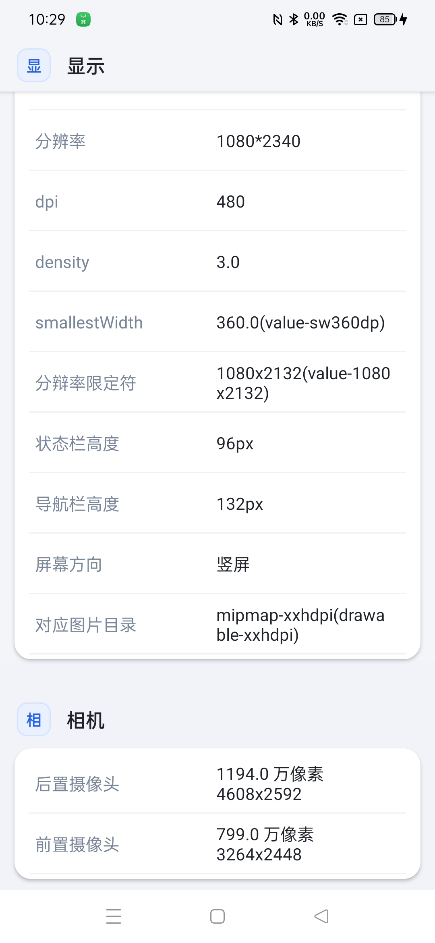

## deviceinfo-master

设备信息查询

目的:

1. 查看设备信息（省去
2. 下载安兔兔这类的重量级、大量广告的应用)
2. 快速找到Android屏幕适配的相关信息（sw限定符、宽高限定符和图片适配等）

demo下载[app-release.apk](app-release.apk)

## 效果图

## 参考

https://blog.csdn.net/ganfanzhou/article/details/84899757